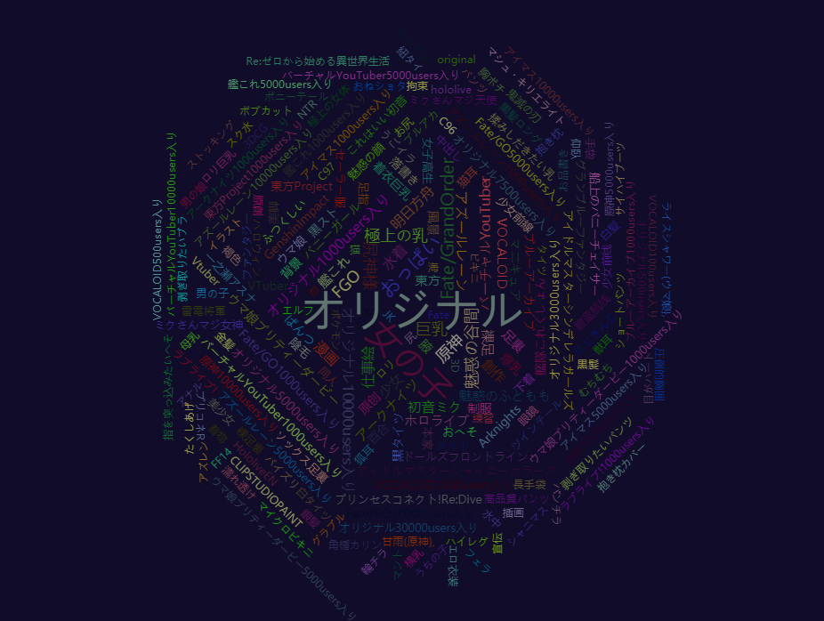

> 说明：请将自己负责书写的内容写到对应的二级标题下。把改进的想法写到 future work 标题以下。如需插入图片，请放在`./img/`路径下。  
> Markdown 的语法可以参考 https://markdown.com.cn/basic-syntax/ 。相信在30分钟内你就可以掌握。  
> 如果你尚没有编辑过markdown，我建议你使用`vscode`+`markdown all in one` 插件编辑
# Make Illustrators Relationship Visible: Final Report of ICE2604 Group 2
</img>
[toc]
## Project Design
There are numerous awesome illustrators and delicate illustrations on the internet.But have you ever thought how they are related to each other?  
Our project aims to find and visualizing the relationship between each illustrator and illustration, by the means of **illustrator map** and **illustration ranking & trending**.  
### Illustrator map
By static the tags of one illustrator's works and turn it to a vector, we can represent the style of an author as a vector. Plotting it one a graph and add following relationship as edges, we get the illustrator map.  
</img>
### Ranking & Trending
By analyze the create date, tags and bookmarks of illustration, we can point out the trending and make predictions.
</img>
***
## Our work
***
## Data and Crawler
### Crawler  
#### Website analysis
The data source of our project is pixiv.net, an online community of artist.  
The data we want include:  
- The basic information of a illustrator
- The following illustrators of one illustrator
- The recent works of illustrators
- The tags of an illustrator
- The basic information of an illustration
- The tags of an illustation

After looking into the XHR of the website, we find these information in two responses:   
- `https://www.pixiv.net/ajax/user/{userId}/illusts/tags?lang=zh`
- `https://www.pixiv.net/ajax/user/{userId}/following?offset={}&limit={}&rest=show&tag=&lang=zh`

The content looks like this:  
```json
// /ajax/user/15158551/following
{
	"error": false,
	"message": "",
	"body": {
		"users": [
			{
				"userId": "15871673",
				"userName": "ユウマ",
				"profileImageUrl": "https://i.pximg.net/user-profile/img/2019/10/27/18/42/33/16468488_e4f111bf6b5e635c0a71caf767e8cc03_170.jpg",
				"userComment": "...",
				"following": false,
				"followed": false,
				"isBlocking": false,
				"isMypixiv": false,
				"illusts": [
					{
						"id": "95076157",
						"title": "『生にしがみつく あまーい味がするね』",
						"illustType": 0,
						"xRestrict": 0,
						"restrict": 0,
						"sl": 4,
						"url": "https://i.pximg.net/c/250x250_80_a2/img-master/img/2021/12/28/00/52/42/95076157_p0_square1200.jpg",
						"description": "",
						"tags": [
							"創作",
							"オリジナル"
						],
						"userId": "15871673",
						"userName": "ユウマ",
						"width": 2480,
						"height": 3508,
						"pageCount": 1,
						"isBookmarkable": true,
						"bookmarkData": null,
						"alt": "#創作 『生にしがみつく あまーい味がするね』 - ユウマ的插画",
						"titleCaptionTranslation": {
							"workTitle": null,
							"workCaption": null
						},
						"createDate": "2021-12-28T00:52:42+09:00",
						"updateDate": "2021-12-28T00:52:42+09:00",
						"isUnlisted": false,
						"isMasked": false,
						"profileImageUrl": "https://i.pximg.net/user-profile/img/2019/10/27/18/42/33/16468488_e4f111bf6b5e635c0a71caf767e8cc03_50.jpg"
					},
					...
				],
				"novels": [],
				"acceptRequest": false
			},
			...
		],
		"total": 86,
		"followUserTags": [],
		"zoneConfig": {
			...
		},
		"extraData": {
			...
		}
	}
}
```
```json
// /ajax/user/15158551/illusts/tags?lang=zh
{
	"error": false,
	"message": "",
	"body": [
		{
			"tag": "オリジナル",
			"tag_translation": "原创",
			"tag_yomigana": "おりじなる",
			"cnt": 77
		},
		{
			"tag": "不思議の国のアリス",
			"tag_translation": "爱丽丝梦游仙境",
			"tag_yomigana": "ふしぎのくにのありす",
			"cnt": 2
		},
		...
	]
}
```

#### Make requests
We makes requests with the python module `requests`. Consider the anti reptile measures, we alse applied `clash` as the agent pool.  
The pixiv has relatively loose anti reptile measures. It only checks `referrence` and `Cookie`.  
```python
def makeRequest(id):
    url='https://www.pixiv.net/ajax/user/{}/following?offset=0&limit=24&rest=show&tag=&lang=zh'.format(id)
    headers = {
        'user-agent': 'Mozilla/5.0 (X11; Linux x86_64; rv:93.0) Gecko/20100101 Firefox/93.0',
        'cookie': 'xxx',
        'referer': 'https://www.pixiv.net/users/{}/following'.format(id),
    }
    proxy = '127.0.0.1:7890'
    proxies = {
        'http': 'http//' + proxy,
        'https': 'https://' + proxy,
    }
    for retries in range(MAX_RETRIES + 1):
        try:
            response = requests.get(url, headers=headers, proxies=proxies).json()
            total = response['body']['total']
            for i in range(24, total, 24):
                url='https://www.pixiv.net/ajax/user/{}/following?offset={}&limit=24&rest=show&tag=&lang=zh'.format(id, i)
                partialResponse = requests.get(url, headers=headers, proxies=proxies).json()
                for user in partialResponse['body']['users']:
                    response['body']['users'].append(user)
            break
        except:
            # retry after 3 seconds
            if retries == 0:
                print(': Network error. Retry in 3 seconds')
            elif retries < MAX_RETRIES:
                print(': Retry {} failed...'.format(retries+1))
            else:
                print(' exited.')
                visitingQueque.put(id)
                exit()
            time.sleep(3)

    visited[id] = 1
    for user in response['body']['users']:
        visitingQueque.put(user['userId'])
    return response
```

#### Cawl the whole net
After finishing one illustrator, we want the cawler to retieve information of other illustrators as well. This can be realized by crawling the following of the current illustrator.  
The following relationship constructs a directed graph of illustrators. If we traverse the net, we can get all the information we want. So, we search the net with BFS.  
```python
visited = {}
visitingQueque = queue.Queue()

while(len(visited) < 10000):
    visitingId = visitingQueque.get()
    while (visitingId in visited) : 
        visitingId = visitingQueque.get()
    response = makeRequest(visitingId)
```

#### Multi-threading
Consider the network I/O takes up most of the time, it is necessary to apply multithreading. In this case, we spawned 4 threads.  
The `visitingQueue` can serve as the scheduler of the threads.  

### Data Sifting
&emsp;&emsp;&emsp;&emsp;To start with, what we had was the raw infomation we clawled from the Pixiv website in the form of **.json**. Which was heavily repeated and took up about 15GB memories after unzipped. 
&emsp;&emsp;&emsp;&emsp;The smallest one of them is like like this:
```json
{
  "error": false,
  "message": "",
  "body": {
    "users": [],
    "total": 0,
    "followUserTags": [],
    "zoneConfig": {
      ...
    },
    "extraData": {
      "meta": {
        ...
      }
    }
  }
}
```
&emsp;&emsp;&emsp;&emsp;The useful part of infomation is in ```json.load(f)["body"]["users"]```, and it's empty here, which means this user whose **userId** is ```"12138318"``` doesn't follow any other users. That's also the reason this file is the smallest.
&emsp;&emsp;&emsp;&emsp;In the list of ```json.load(f)["body"]["users"]``` are all of the users that this user is following. And all I need to do is collect their userIds because **userId** can convey the infomation between them.
&emsp;&emsp;&emsp;&emsp;However, there's one problem. Fisrt, we have no infomation about users themselves. If I colloct only the **userId**, all we would got is some numbers. And there's no more infomation about the user himself in his own json file. So I need to get the infomation from other users that are following this user. Doing this has a risk that if one user isn't being followed by other user then hinself would have no detailed infomation. We won't even know his userName. 
&emsp;&emsp;&emsp;&emsp;Luckily, we could prove that every user in the dir has someone following him except one because Huang haoxv collected them using DFS method and all of the users we saved must has someone following him except the first user chosen to be the start node.
&emsp;&emsp;&emsp;&emsp;A single elem in ```json.load(f)["body"]["users"]``` would be like this:
```json
{
    "userId": "12331100",
    "userName": "飲用海",
    "profileImageUrl": "https://i.pximg.net/user-profile/img/2021/08/28/11/48/2021311004_c1b0ddbb900a4a72f3150b8f82de6026_170.jpg",
    "userComment": "",
    ...
    "illusts": [
      {
        "id": "94014080",
        "title": "まふゆ",
        ...
        "url": "https://i.pximg.net/c/250x250_80_a2/custom-thumb/img/2021/11/09/02/08/51/94014080_p0_custom1200.jpg",
        "description": "",
        "tags": [
          "プロジェクトセカイ",
          "プロセカ",
          "25時、ナイトコードで。",
          "朝比奈まふゆ",
          "プロセカ100users入り"
        ],
        ...
        "createDate": "2021-11-09T02:08:51+09:00",
        "updateDate": "2021-11-09T02:08:51+09:00",
        ...
      },
      ...
    ],
    ...
}
```
&emsp;&emsp;&emsp;&emsp;It's cozy that there're four illusts in ```json.load(f)["body"]["users"]["illusts"]```. As you could see, the infomation we could collect contains:

- userId
- userName
- userComment
- profileImageUrl
- illusts
- createDate

&emsp;&emsp;&emsp;&emsp;And with the following relation we got, I made two tables in MySQL like this:
|Users|illusts|
|:-:|:-:|
|||
&emsp;&emsp;&emsp;&emsp;Here's the code that fill in the table:
```python
import json,os,pymysql
from tqdm import tqdm

users={files[:files.find('.')] for files in os.listdir("responses")}
d1,d,imgs,d2={},{},{},{}
for User_ID in tqdm(users):
    with open("responses/{}.json".format(User_ID),"rb") as f:
        a=json.load(f)["body"]["users"]
    d1_User_ID=[]
    for _ in a:
        if _["userId"] in users:
            d1_User_ID.append(_["userId"])
            if not _["userId"] in d:
                user={att:_[att] for att in ["userId","userName","profileImageUrl","userComment"]}
                user["illusts"]=[{att:his_imgs[att] for att in ["id","title","url","tags"]} for his_imgs in _["illusts"]]
                d[_["userId"]]=user
            for img in _["illusts"]:
                if not img["id"] in imgs:
                    imgs[img["id"]]={i:img[i] for i in ["id","title","url","tags","userId","createDate"]}
    d1[User_ID]=d1_User_ID
del User_ID,a,d1_User_ID,_,user,img
for userId in tqdm(d1):
    for his_follows in d1[userId]:
        if his_follows in d2:
            d2[his_follows]=d2[his_follows]+[userId]
        else:
            d2[his_follows]=[userId]
del userId,his_follows

conn=pymysql.connect(
    host="XXX",
    port=xxx,
    user='XXX',
    password="XXXX",
    database='XXXX',
    charset='utf8mb4'
)
cursor=conn.cursor()

tmp=[[d[userId][i] for i in ["userId","userName","profileImageUrl","userComment"]]+[",".join([_["id"] for _ in d[userId]['illusts']]),",".join(d1[userId]),len(d1[userId]),",".join(d2[userId]),len(d2[userId])] for userId in d]
cursor.executemany("INSERT INTO Users (userId,userName,profileImageUrl,userComment,illusts,following,following_count,follower,follower_count) VALUES (%s,%s,%s,%s,%s,%s,%s,%s,%s)",tmp)
conn.commit()
tmp=[[imgs[img_id][k] for k in ["id","title","url"]]+[",".join(imgs[img_id]["tags"])]+[imgs[img_id][k] for k in ["userId","createDate"]] for img_id in imgs]
cursor.executemany("INSERT INTO illusts (id,title,url,tags,userId,createDate) VALUES (%s,%s,%s,%s,%s,%s)",tmp)
conn.commit()
```
&emsp;&emsp;&emsp;&emsp;Also, I used ```tqdm``` to add a process bar to visualize the procedure of the program.
***
## Search Engine
The search engine is based on Elastic Search. We aim to search illustrators and illustrations by id, name, tag.  
Because we want the exact id, so the id is `keyword` type. The name/title and tags are text type.  
Since the name, title and tags contain Chinese and Japanese, we tokenize them with an plugin `analysis-icu`.  
```python
illusts_mappings = {
    "settings": {
        "index": {
            "analysis": {
                "analyzer": {
                    "cjk_analyzer": {
                        "type": "custom",
                        "tokenizer" : "icu_tokenizer"
                    }
                }
            }
        }
    },
    "mappings" : {
        "properties": {
            "id": {
                "type": "keyword",
            },
            "title": {
                "type": "text",
                "analyzer": "cjk_analyzer"
            },
            "url": {
                "type": "keyword",
            },
            "tags": {
                "type": "text",
                "analyzer": "simple"
            },
            "userId": {
                "type": "keyword",
            },
            "createDate": {
                "type": "keyword",
            },
            "bookmark_count": {
                "type": "long",
            }
        }
    }
}
```
***
## Visualization
### Data Charts 
We prepared a page called "statics" to show our data size and ranking lists of some data,aiming to enrich the content of our site.

It's mainly consist of 4 pictures, an authors ranking list,a tags ranking list, a development tendency chart of the tags in last 7 years and the word cloud picture of all the tags.

Using the echarts,we can easily make these pictures.

#### Tools Used
```html
<script src="/static/echarts.js"></script>
<script src="/static/jquery.js"></script>
<script src="/static/echarts-wordcloud1.js"></script>
```
The third one is used for the wordcloud picture. 
#### Data Acquisition 
All the data come from our crawler and database.

Through two ways,we can let the charts get the data.
##### 1. put the data in the charts(direct access)
like this:
```js
series: [...
    data: [51,74,147,199,395,667,3125]
    ...]
```
##### 2. put the data in the main.cpp(Asynchronous access)
It's more convenient to change the data througe this way.

like this:
```python
@app.route('/data', methods=['GET'])
def get_data():
    data={
    "categories":["巨乳","魅惑の谷間","Fate/GrandOrder","おっぱい" ,"女の子","オリジナル"],
    "data":[753,  769  ,896,1184,2990,4306],
     }
    return json.dumps(data)

```

#### Layout
The four pictures are put on the website side by side.
```html

<div id="main1" style="width: 50%;height: 600px;float:left;border: 1px solid rgb(0, 0, 0);"></div>
<div id="main3" style="width: 50%;height: 600px;float:right;border: 1px solid rgb(0, 0, 0);"></div>
<div id="main2" style="width: 50%;height: 700px;float:left;border: 1px solid rgb(0, 0, 0);"></div>
<div id="main4" style="width: 50%;height: 700px;float:right;border: 1px solid rgb(0, 0, 0);"></div>

```
#### The Pictures
##### 1. Two Normal Bar Charts.
The Asynchronous access one is like this:
```js
var mychart =echarts.init(document.getElementById('main1'),'dark');
$.getJSON('/data').done(function(data){
    mychart.setOption({
    color: [ '#00DDFF'],
    title:{
    text: 'Top6 Tags',
    x:'center',
    top:'20',
    textStyle: {
    "fontSize": 24
    },
    },
    tooltip:{},
    legend:{
        data:["作品数"],
        textStyle: {
        "fontSize": 16
    },
    x:'right',
    },
   yAxis:{
        type : 'category',
        data:data.categories,
        
        axisLabel: {
            show: true,
            textStyle: {
                color: '#FFFFFF',
            },
            fontSize: 12.5,
            interval:0,  
            rotate:45  

        },
        
    },

    xAxis:{ axisLabel: {
            show: true,
            textStyle: {
                color: '#FFFFFF',
            },
            fontSize: 12.5,
        },},
    series:[
        {
            name:'作品数',
            type:'bar',
            data:data.data,
            
        }
    ]
    });

```
The direct access is similar, but cut
```js
$.getJSON('/data').done(function(data)
```
The two pictures look like:

</img>

</img>

##### 2. The Tendency Chart.
It's based on the basic bar charts but change the way to deal with the data.

In the "series" section, add the "areaStyle".

```js
series: [
            ...
            showSymbol: false,
            areaStyle: {
                opacity: 0.8,
                color: new echarts.graphic.LinearGradient(0, 0, 0, 1, [
                {
                    offset: 0,
                    color: 'rgba(255, 131, 0)'
                },
                {
                    offset: 1,
                    color: 'rgba(124, 62, 76)'
                }
                ])
            },
            emphasis: {
                focus: 'series'
            },
            data: ...
        ......
        ]
```
It makes a picture like this, which can exhibit the tendency through years.

</img>

It also can just focus on partial data like this.

</img>

##### 3. The Wordcloud Chart.

We used a new js file to provide the function to make the wordcloud chart.
```js
<script src="/static/echarts-wordcloud1.js"></script>
```
The chart is a little different from the bar charts, mainly the "series" part ,it used the color gradient function

The different part is like this:
```js
    series: [ {
    type: 'wordCloud',
    gridSize: 2,
    sizeRange: [12, 50],
    rotationRange: [-90, 90],
    width: 1000,
    height: 1000,
    drawOutOfBound: true,
    textStyle: {
        
            color: function () {
                return 'rgb(' + [
                    Math.round(Math.random() * 160),
                    Math.round(Math.random() * 160),
                    Math.round(Math.random() * 160)
                ].join(',') + ')';
            
        },
        emphasis: {
            shadowBlur: 10,
            shadowColor: '#333'
        }
    },
    data:data.word,}]
```
The wordcloud picture look like this:
</img>

***
## Website
### Valid Picture 
&emsp;&emsp;&emsp;&emsp;We already have the **url** of each image. However, the **url** is not only forbidden here but also could not request directly because their anti-crawler methods. At first, we thought of save all of the pictures to loacl. But after computing the approximate sizeof the images, we decided to give up. Not only because It's too large to store, but also because we could not use **wifi** and the cost is too high.
&emsp;&emsp;&emsp;&emsp;Suddenly, we thought of getting the image from other source. I found a mirror website of Pixiv and found that the **url** of this website is kind of similar to Pixiv. What we would have to do is converting ```"https://i.pximg.net/c/250x250_80_a2/img-master/img/2010/09/22/00/19/05/13399152_p0_square1200.jpg"``` to ```https://proxy.pixivel.moe/img-original/img/2010/09/22/00/19/05/13399152_p0.jpg``` or ```https://proxy-jp1.pixivel.moe/c/600x1200_90/img-master/img/2010/09/22/00/19/05/13399152_p0_master1200.jpg```. 
&emsp;&emsp;&emsp;&emsp;Here comes the problem that this mirror website is not good enough to provide all images we needed. In other word, some of the **url** is not valid. 
&emsp;&emsp;&emsp;&emsp;To avoid our website from showing a lot of broken images, we need to check all the urls. Which is quite time consuming. Here's the code:
```python
import pymysql,json,os
from tqdm import tqdm
users=set()
for files in os.listdir("responses"):
    users.add(files[:files.find('.')])
imgs=dict()
for User_ID in tqdm(users):
    with open("responses/{}.json".format(User_ID),"rb") as f:
        for _ in json.load(f)["body"]["users"]:
            if _["userId"] in users:
                for img in _["illusts"]:
                    if not img["id"] in imgs:
                        imgs[img["id"]]={i:img[i] for i in ["id","title","url","tags","userId","createDate"]}
conn=pymysql.connect(
    host="XXX",
    port=xxx,
    user='XXX',
    password="XXXX",
    database='XXXX',
    charset='utf8mb4'
)
cursor=conn.cursor()
tmp=[[imgs[img_id][k] for k in ["id","title","url"]]+[",".join(imgs[img_id]["tags"])]+[imgs[img_id][k] for k in ["userId","createDate"]] for img_id in imgs]
cursor.executemany("INSERT INTO illusts (id,title,url,tags,userId,createDate) VALUES (%s,%s,%s,%s,%s,%s)",tmp)
conn.commit()
```
&emsp;&emsp;&emsp;&emsp;This took me about a whole day. And I'd have to run another. (```url_foruse``` is a newly added col which stores the **url** that could be requestd directly)
```python
import requests,pymysql
from tqdm import tqdm
conn=pymysql.connect(
    host="XXX",
    port=xxx,
    user='XXX',
    password="XXXX",
    database='XXXX',
    charset='utf8mb4'
)
cursor=conn.cursor()
cursor.execute("SELECT id,url from illusts where url_foruse is NULL")
ills=cursor.fetchall()

hea="""Referer: XXXX
sec-ch-ua: XXXX
sec-ch-ua-mobile: XXXX
sec-ch-ua-platform: XXXXX
User-Agent: XXXXX""".split('\n')
hea={i[:i.find(':')].strip():i[i.find(':')+1:].strip() for i in hea}

for ill in tqdm(ills):
    _url="https://proxy.pixivel.moe/img-original/img/"+ill[1][ill[1].find("/img/")+len("/img/"):].replace("_square1200.jpg",".jpg")
    resp=requests.get(_url,stream=True)
    if resp.status_code==200:
        cursor.execute("UPDATE illusts SET url_foruse=%s WHERE id=%s",(_url,ill[0]))
        conn.commit()
    else:
        _url="https://proxy-jp1.pixivel.moe/c/600x1200_90/img-master/img/"+ill[1][ill[1].find("/img/")+len("/img/"):ill[1].find(ill[0])+len(ill[0])]+"_p0_master1200.jpg"
        resp=requests.get(_url,stream=True)
        if resp.status_code==200:
            cursor.execute("UPDATE illusts SET url_foruse=%s WHERE id=%s",(_url,ill[0]))
            conn.commit()
        else:
            cursor.execute("UPDATE illusts SET url_foruse=%s WHERE id=%s",("None",ill[0]))
            conn.commit()
```
&emsp;&emsp;&emsp;&emsp;At that time I havn't learnt much about **html** and **js** and didn't known about ```onerror``` of ```</img>```. If I'd know that, I wouldn't run a program that is such time consuming.
```html
<script>
    function imgerrorfun(x){
        var img=event.srcElement;
        img.src=x;
        img.onerror=function(){
            event.srcElement.parentNode.parentNode.parentNode.remove();
        };
    }
</script>
...
<div ...>
    <div ...>
        <div ...>
            
        </div>
    </div>
</div>
```
&emsp;&emsp;&emsp;&emsp;By doing things like this, when ```source_1.png``` is not valid, the ```src``` would be changed to ```source_2.png```, and when ```source_2.png``` is still not valid, the whole **div** that contains this img would be removed. Thus, the webpage will have no broken image be shown.

***
## Team cooperation
### Source Code Management
We managed our code with git and a GUI tool: source tree. So far, there are 72 commits, and every group member has made commit to the repository.   
</img>

### Database
We put our data on the cloud server of Alilibaba, so every member has access to the latest data.
## Future work
### Illustration Feature
The hash function used on illustrators doesn't discriminate illustrations well.  
</img>  
Current features are all based on illustration tags, rather than illustration itself. So next step, we can apply computer vision method, 
such as ResNet or AlexNet.

### Handle Synonymous Tags
There are many synonymous tags in our data. However, the PCA algorithm can't tell if two tags hane the same meaning. For example, following four tags all refer to the same character.  
</img>
NLP method should be applied to find these tags of similar meanings. For example, GloVe can construct coexistence matrix, thus find the words that most likely to have the same meaning.  
</img>
***
## Duty
- Data and crawler: 黄川懿，薛家奇，黄浩栩
- Search engine: 黄浩栩
- Visualization: 王鹏飞，向天乐，薛家奇
- Website: 黄川懿，向天乐，薛家奇，黄浩栩
